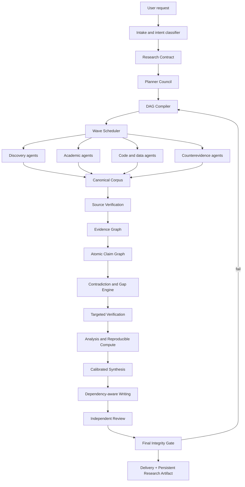

# Arquitetura SOTA para um Super Deep Research superior ao Kimi Swarm

## KimiSwarm Deep Research vNext — KDR-X

**Data da análise:** 19 de agosto de 2026  
**Escopo:** análise técnica dos quatro repositórios indicados, comparação com o Kimi Swarm reconstruído e definição de uma arquitetura de deep research de próxima geração.  
**Natureza das notas:** julgamento de engenharia baseado em inspeção do código, skills, agentes, schemas, scripts, testes, workflows, documentação e licenças. As notas não são resultados de um benchmark executado em igualdade de condições.

---

## 1. Veredito executivo

Há três respostas diferentes para a pergunta “qual é o melhor?”:

1. **Melhor desenho de pesquisa e rigor epistemológico:**  
   **Imbad0202/academic-research-skills — ARS.**

2. **Melhor base permissiva e operacional para um produto em Claude Code:**  
   **affaan-m/ECC.**

3. **Melhor arquitetura final para o projeto do Rafael:**  
   **não usar nenhum dos quatro isoladamente.** Manter o `rafaelsmc1987/kimiswarm` como control plane e construir uma composição clean-room:

   - **Kimi Swarm:** plano, DAG, waves, workers, progressive skill loading, stage gates e filesystem como estado;
   - **ARS:** rigor científico, source verification, claim audit, integrity gates, devil's advocate, bias, PRISMA e avaliação;
   - **Orchestra:** Agent-Native Research Artifact, provenance, exploration graph, claims↔experiments↔evidence e ciclo de experimentação;
   - **ECC:** plugin/runtime, hooks determinísticos, memória, hardening, testes, observabilidade e aprendizagem contínua;
   - **Weizhena:** `outline.yaml`, `fields.yaml`, pesquisa por itens, retomada, batches e interação humana simples.

### Decisão recomendada

> **O repositório-base do produto deve continuar sendo o seu KimiSwarm.**  
> Para acelerar a infraestrutura, reutilize componentes MIT do ECC, Orchestra e Weizhena.  
> Reimplemente os conceitos mais fortes do ARS em clean-room, sem copiar seus textos ou código para um produto comercial, pois o ARS usa CC BY-NC 4.0.

---

## 2. Ranking analítico

| Projeto | Nota ponderada |
|---|---:|
| Academic Research Skills — ARS | **85.50/100** |
| Kimi Swarm reconstruído — referência | **77.82/100** |
| ECC | **74.91/100** |
| Orchestra AI-Research-SKILLs | **72.05/100** |
| Weizhena Deep-Research-skills | **58.15/100** |

A nota do ARS cai por causa da restrição não comercial. Sem o critério de licença, ele se distancia ainda mais na liderança de qualidade de pesquisa. O ECC sobe por maturidade operacional, mas a skill de deep research dele, isoladamente, é mais simples que a do Kimi.

### Pesos usados

| Dimensão | Peso |
|---|---:|
| Rigor epistemológico | 20 |
| Orquestração multiagente | 15 |
| Busca e recuperação | 12 |
| Proveniência e reprodutibilidade | 12 |
| Runtime e hardening | 10 |
| Evals e testes | 10 |
| Arquitetura geral | 8 |
| Extensibilidade | 5 |
| HITL e retomada | 4 |
| Licença para produto comercial | 4 |

A matriz completa está em `MATRIZ_COMPARATIVA_REPOS.csv`.

---

# Parte I — análise dos repositórios

## 3. Orchestra-Research/AI-Research-SKILLs

### 3.1 O que o projeto realmente é

É uma biblioteca ampla de skills de engenharia de pesquisa em IA. Seu valor não está em um scheduler multiagente completo, mas em protocolos especializados que cobrem:

- formulação de problemas;
- revisão de literatura;
- planejamento experimental;
- execução e análise de experimentos;
- escrita científica;
- artefatos de pesquisa;
- reprodutibilidade;
- publicação e disseminação.

O projeto é particularmente forte em dois núcleos:

1. **Autoresearch**, um ciclo autônomo de hipótese → experimento → análise → decisão;
2. **ARA — Agent-Native Research Artifact**, um formato estruturado para representar pesquisa de maneira auditável e navegável por agentes.

### 3.2 Autoresearch

O Autoresearch trata pesquisa como um processo iterativo persistente. Ele mantém:

- estado do projeto;
- backlog de hipóteses;
- protocolo bloqueado;
- logs de experimentos;
- findings;
- literatura;
- datasets;
- scripts;
- drafts;
- handoffs ao humano.

Seu melhor conceito é a separação entre:

- **inner loop:** executar e comparar experimentos;
- **outer loop:** sintetizar o que foi aprendido e decidir entre aprofundar, ampliar, pivotar ou concluir.

Isso é superior a um deep research que apenas faz buscas e escreve um relatório, porque transforma a pesquisa em um processo científico cumulativo.

### 3.3 ARA

O ARA é a contribuição mais valiosa do Orchestra para o nosso sistema. Ele estrutura uma pesquisa em camadas:

```text
PAPER.md
logic/
  problem.md
  claims.md
  concepts.md
  experiments.md
  solution/
src/
  configs/
  execution/
  environment.md
trace/
  exploration_tree.yaml
evidence/
  tables/
  figures/
```

As ligações importantes são:

```text
Claim
  ↕
Experiment
  ↕
Evidence
  ↕
Code/config
  ↕
Exploration/decision trace
```

O compiler exige:

- claims falsificáveis;
- evidência exata;
- números sem arredondamento indevido;
- separação entre observação e interpretação;
- dead ends;
- nós explícitos versus inferidos;
- coverage loop;
- validação estrutural;
- revisão epistemológica.

O `rigor-reviewer` avalia seis dimensões:

1. relevância da evidência;
2. qualidade da falsificabilidade;
3. calibração de escopo;
4. coerência do argumento;
5. integridade da exploração;
6. rigor metodológico.

### 3.4 Pontos fortes

- Melhor modelo de **artefato persistente de pesquisa** entre os quatro.
- Excelente ligação entre claims, experimentos, dados e código.
- Captura decisões, pivôs e dead ends.
- Separação clara entre evidência direta e interpretação.
- Fortíssimo para pesquisa experimental em ML/IA.
- Licença MIT.
- Skills modulares e portáveis entre vários harnesses.

### 3.5 Pontos fracos

- Não é um scheduler geral equivalente ao Kimi.
- O paralelismo multiagente é menos central e menos formalizado.
- A pipeline é mais voltada a ciência experimental do que a investigação web geral.
- A validação é fortemente especificada em prompts; parte dela precisa virar código determinístico.
- O repositório possui menos evidência de benchmark contínuo da qualidade de pesquisa que o ARS.
- A raiz e o pacote publicável apresentam pequenas inconsistências de metadata/licença/testes.

### 3.6 O que aproveitar

**Reutilização direta possível sob MIT:**

- formato ARA;
- exploration DAG;
- provenance tags;
- claims↔experiments↔evidence;
- coverage loop;
- Seal Level 1;
- rigor review dimensions;
- preregistration/protocol lock;
- experiment state machine.

**Não usar como runtime principal.**

---

## 4. Weizhena/Deep-Research-skills

### 4.1 O que o projeto realmente é

É um workflow leve e pragmático para **pesquisa estruturada de muitos objetos**. O fluxo principal é:

```text
/research
  → outline.yaml
  → fields.yaml
  → /research-deep
  → um JSON por item
  → /research-report
```

Ele é excelente para perguntas do tipo:

- comparar dezenas de produtos;
- mapear empresas;
- pesquisar repositórios;
- criar um catálogo de tecnologias;
- preencher um schema comum para muitos objetos.

### 4.2 Componentes principais

#### `outline.yaml`

Define:

- tópico;
- objetos;
- configuração de execução;
- batch size;
- items per agent;
- output directory.

#### `fields.yaml`

Define:

- categorias;
- campos;
- nível de detalhe;
- campos obrigatórios;
- campos incertos.

#### Pesquisa por item

Cada worker recebe um ou mais itens e produz um JSON estruturado. O sistema:

- pula itens completos;
- suporta retomada;
- executa em batches;
- marca incertezas;
- valida cobertura de campos.

#### Web-search agent modular

Antes de pesquisar, o worker carrega um módulo:

- academic papers;
- general web;
- GitHub/debug;
- Chinese tech;
- Stack Overflow.

Isso é um bom exemplo de progressive loading aplicado à estratégia de busca.

### 4.3 Pontos fortes

- Melhor UX de **schema-first research**.
- Excelente para pesquisa tabular e comparativa.
- Interação humana simples para definir items e fields.
- Retomada natural por arquivo.
- Batches controláveis.
- Modularização de estratégias de busca.
- Licença MIT.
- Simples de entender e portar.

### 4.4 Pontos fracos

O validador verifica principalmente presença de campos, não verdade:

```text
campo existe?
campo obrigatório está presente?
qual a cobertura do schema?
```

Ele não verifica adequadamente:

- se a fonte existe;
- se o campo está apoiado pela fonte;
- se o valor foi extraído corretamente;
- se duas fontes discordam;
- se a citação implica o claim;
- se a fonte é independente;
- se houve cherry-picking;
- se a incerteza está calibrada;
- se a busca atingiu saturação.

Também há pouca infraestrutura de:

- revisão adversarial;
- claim graph;
- source graph;
- contradiction resolution;
- evals de qualidade;
- segurança de conteúdo recuperado.

### 4.5 O que aproveitar

- `outline.yaml`;
- `fields.yaml`;
- items-per-agent;
- batches;
- resume;
- uncertain registry;
- field coverage;
- módulos de busca;
- comandos para adicionar itens/campos;
- relatório tabular.

**Não usar como núcleo epistemológico.**

---

## 5. affaan-m/ECC

### 5.1 O que o projeto realmente é

O ECC não é principalmente um deep-research system. É um **sistema operacional para agent harnesses**, com:

- plugin Claude Code;
- dezenas de agentes;
- centenas de skills;
- comandos;
- hooks;
- memória;
- segurança;
- testes;
- adaptadores para múltiplos harnesses;
- aprendizagem contínua;
- fluxos multi-modelo.

Sua skill `deep-research` é útil, mas relativamente convencional:

```text
3–5 subperguntas
2–3 variações por subpergunta
15–30 fontes
3–5 fontes lidas em profundidade
até 3 agentes
síntese final
```

Isso não supera o Kimi por si só.

### 5.2 O verdadeiro valor do ECC

#### Plugin e instalação

Possui estrutura de plugin pronta, configuração de usuário e distribuição de skills/comandos.

#### Hooks determinísticos

O ECC usa hooks para regras que não podem depender apenas da boa vontade do modelo:

- PreToolUse;
- PostToolUse;
- Stop;
- SessionStart;
- SessionEnd;
- PreCompact.

Eles podem:

- bloquear;
- alertar;
- formatar;
- rodar checks;
- preservar estado;
- registrar custo;
- detectar padrões;
- aplicar quality gates.

#### Agentic OS

Propõe:

```text
CLAUDE.md
agents/
commands/
scripts/
data/
```

Com memória em JSON/Markdown, logs append-only e roteamento declarativo.

#### Continuous Learning v2

Captura observações por hooks e gera “instintos”:

- atômicos;
- com confiança;
- escopados ao projeto;
- apoiados por evidência;
- promovíveis a skill/command/agent.

### 5.3 Pontos fortes

- Melhor runtime e packaging.
- Melhor biblioteca de hooks.
- Melhor maturidade de testes operacionais.
- Memória persistente.
- Aprendizagem contínua.
- Forte extensibilidade.
- Cross-platform/cross-harness.
- Licença MIT.
- Muito útil para transformar a pesquisa em produto robusto.

### 5.4 Pontos fracos

- Deep research nativo é raso.
- Não possui, no núcleo de pesquisa, rigor equivalente ao ARS.
- Não possui ARA/claim graph por padrão.
- A diversidade enorme de skills pode aumentar drift e conflito.
- Parte dos workflows depende de runtime externo.
- Roteamento declarativo em Markdown não basta para um scheduler SOTA; deve haver executor determinístico.

### 5.5 O que aproveitar

- plugin scaffold;
- hooks;
- memory persistence;
- PreCompact;
- continuous learning;
- profiles de segurança;
- test architecture;
- multi-harness adapters;
- cost/context telemetry;
- commands/installer.

**Usar como base operacional, não como cérebro de pesquisa.**

---

## 6. Imbad0202/academic-research-skills — ARS

### 6.1 O que o projeto realmente é

É a suíte mais completa dos quatro para pesquisa acadêmica e científica. Sua pipeline inclui:

- question formulation;
- methodology;
- systematic search;
- source verification;
- synthesis;
- devil's advocate;
- ethics;
- risk of bias;
- meta-analysis;
- report;
- peer review;
- revision;
- integrity gates;
- finalization;
- process summary.

O deep research possui 13 agentes e oito modos:

- full;
- quick;
- review;
- lit-review;
- fact-check;
- three-way scan;
- Socratic;
- systematic review/meta-analysis.

### 6.2 O que torna o ARS superior

#### Source verification

O sistema tenta distinguir:

- fonte real;
- fonte fabricada;
- DOI errado;
- mashup de autores/título/venue;
- metadata inconsistente;
- journal predatório;
- conflito de interesse;
- fonte antiga para domínio rápido;
- força metodológica;
- apoio independente.

Ele não aceita “difícil de verificar” como zona confortável.

#### Claim integrity

A pipeline registra populations e samples, verifica claims de alto impacto e executa audits antes e depois da revisão.

#### Integrity gates

Há gates separados de escrita e peer review. Isso evita que um texto fluente esconda:

- referência fabricada;
- dado inventado;
- source misrepresentation;
- bug transformado em insight;
- methodology fabrication;
- frame lock;
- shortcut reliance.

#### Adversarial review

Devil's advocate aparece em múltiplos checkpoints, não só no final.

#### Academic modes

PRISMA, RoB 2, ROBINS-I, GRADE, meta-analysis e systematic review estão explicitamente previstos.

#### Eval harness

O repositório possui:

- gold sets;
- regression thresholds;
- seeded defect checks;
- CI;
- freshness;
- citation extraction;
- status classification;
- RQ framing;
- summarization adequacy.

### 6.3 Pontos fortes

- Maior rigor epistemológico.
- Melhor source verification.
- Melhor cobertura de academic integrity.
- Melhor human-in-the-loop.
- Melhor pipeline de revisão.
- Forte variedade de modos.
- Boa arquitetura de evals.
- Prompt-injection boundary explícita.
- Transparência de limitações, conflitos e AI disclosure.

### 6.4 Pontos fracos

- Licença **CC BY-NC 4.0**: não copiar para produto comercial sem autorização.
- Academic-centric: algumas regras não generalizam diretamente a mercado, software, política ou inteligência competitiva.
- A hierarquia de evidência precisa ser domain-relative.
- Muitos checkpoints humanos podem tornar a rota geral lenta.
- Parte significativa da enforcement ainda é prompt-level.
- A complexidade pode gerar protocolo excessivo em tarefas simples.
- Verificar existência da fonte não prova entailment do claim.
- O sistema ainda precisa de um scheduler central mais parecido com o Kimi.

### 6.5 O que aproveitar

Como ideias clean-room:

- source identity verification;
- citation hallucination taxonomy;
- integrity gates;
- risk-stratified claim audit;
- devil's advocate;
- evidence hierarchy domain-relative;
- PRISMA/RoB/GRADE adapters;
- material passport;
- anti-silent-upgrade;
- eval harness;
- seeded defects;
- model tiering;
- monitoring/retraction alerts.

### 6.6 Restrição legal

Para um produto comercial:

- não copie prompts, arquivos ou código do ARS;
- documente requisitos funcionais em linguagem própria;
- implemente a partir de especificações independentes;
- mantenha uma clean-room record;
- ou obtenha licença comercial do autor.

---

# Parte II — o que falta no Kimi

## 7. O que o Kimi já faz melhor

O Kimi continua sendo o melhor **control plane conceitual**:

- `plan.md` first;
- rotas adaptativas;
- decomposição em dimensões;
- agentes em waves;
- classes de agentes customizadas;
- progressive skill loading;
- foreground/background;
- context routing;
- files as shared state;
- cross-verification;
- targeted validation;
- insight after validation;
- research/writing separation;
- chapter rounds;
- independent reviewers;
- artifact conversion.

Nenhum dos quatro substitui integralmente essa mecânica.

## 8. Limitações do Kimi que o novo sistema deve corrigir

### 8.1 Fixed search budgets

Contar 150, 200 ou 250 buscas é um proxy fraco. O stopping criterion deve usar:

- marginal evidence gain;
- source diversity gain;
- claim coverage;
- unresolved critical claims;
- contradiction closure;
- novelty saturation;
- budget ceiling.

### 8.2 Documento-first em vez de claim-first

O Kimi organiza bem arquivos e capítulos, mas o núcleo precisa ser:

```text
atomic claim
  → exact evidence span
  → source identity
  → source quality
  → relation
  → independence
  → standing
  → report usage
```

### 8.3 Citation presence versus citation correctness

Uma citação pode existir e ainda assim:

- não apoiar o claim;
- apoiar apenas metade;
- estar fora de contexto;
- ser secundária quando existe fonte primária;
- contradizer o texto;
- vir de fontes dependentes entre si.

### 8.4 Insuficiente benchmark harness

Precisamos medir qualidade por tarefas e regressões, não por impressão do relatório.

### 8.5 Multimodalidade

Gráficos, tabelas, PDFs e imagens devem participar do evidence graph.

### 8.6 Cross-lingual retrieval

Pesquisas devem variar idioma, localidade e terminologia, sem reduzir tudo ao idioma da pergunta.

### 8.7 Calibration

Confiança deve ser derivada de evidência e registrada por claim. Não deve ser apenas um adjetivo gerado pelo modelo.

### 8.8 Security

Conteúdo recuperado é dado não confiável. Nunca pode alterar o workflow ou o rubric.

---

# Parte III — arquitetura SOTA proposta

## 9. Nome de trabalho

**KDR-X — KimiSwarm Deep Research eXtended**

Princípio:

> Um scheduler central produz um DAG adaptativo; agentes especializados coletam, verificam, falsificam, analisam e escrevem; todo claim é ligado a evidência exata; cada estágio passa por gates determinísticos e independentes.

## 10. Dez camadas

```text
1. Control Plane
2. Research Contract
3. Retrieval & Corpus
4. Source Trust
5. Claim-Evidence Graph
6. Falsification & Contradiction
7. Analytical Compute
8. Calibrated Synthesis
9. Review & Integrity
10. Persistent Research Artifact
```

## 11. Diagrama macro



---

## 12. Research Contract

Antes do plano, o sistema materializa um contrato:

```yaml
objective:
decision_context:
audience:
scope:
in_scope:
out_of_scope:
time_window:
geography:
languages:
source_policy:
required_primary_sources:
prohibited_sources:
freshness:
output_format:
risk_level:
budget:
human_checkpoints:
success_metrics:
```

O contrato impede que agents interpretem o objetivo de formas incompatíveis.

---

## 13. Rotas

### R0 — Quick Verified Brief

- 3–5 claims;
- fontes primárias;
- source verification;
- um verifier;
- relatório curto.

### R1 — Focused Deep Research

- pergunta delimitada;
- planner council leve;
- 5–8 dimensões;
- cross-verification;
- targeted validation.

### R2 — Wide Landscape

- landscape scan;
- broad facets;
- independent overlap;
- dimension compiler;
- deep dives.

### R3 — File Only

- nenhum source externo;
- evidence spans por página/linha;
- lacunas não preenchidas externamente.

### R4 — File Augmented

- corpus fornecido como base;
- busca orientada a gaps;
- source hierarchy preserva os arquivos primários.

### R5 — Academic

- RQ;
- methodology;
- systematic search;
- source verification;
- synthesis;
- bias;
- report.

### R6 — Systematic Review / Meta-analysis

- protocol lock;
- PICOS;
- PRISMA;
- dual screening;
- risk of bias;
- GRADE;
- statistical synthesis.

### R7 — Structured Enumeration

- `outline.yaml`;
- `fields.yaml`;
- items;
- per-field evidence;
- resume;
- tabular report.

### R8 — Code/Repository Research

- architecture;
- commit/history;
- tests;
- execution;
- docs;
- issue/PR evidence;
- code citations.

### R9 — Data-first Investigation

- datasets;
- schema;
- lineage;
- analyses;
- calculations;
- charts;
- reproducibility.

### R10 — Multimodal

- PDFs;
- figures;
- tables;
- diagrams;
- video/image evidence;
- text-visual consistency.

### R11 — Cross-lingual

- search plans per language;
- local source agents;
- translation alignment;
- cross-language contradiction checks.

### R12 — Continuous Monitoring

- saved query plan;
- delta retrieval;
- new source classification;
- retraction alerts;
- standing updates;
- report diff.

---

## 14. Planner Council

Não usar um único planner. Executar cinco perspectivas em paralelo:

1. **Requirements Planner**
2. **Question/Scope Planner**
3. **Retrieval Planner**
4. **Methodology Planner**
5. **Risk/Verification Planner**

Depois:

- plan reviewer;
- DAG verifier;
- plan synthesizer.

O output é:

```text
plan.md
research_contract.yaml
manifest.json
dag.json
waves.json
tasks/*.json
ownership.json
budget.json
acceptance_matrix.json
```

---

## 15. DAG compiler

Cada task contém:

```json
{
  "task_id": "T-R2-D03",
  "stage": "retrieval",
  "wave": 3,
  "role": "academic_searcher",
  "mission": "...",
  "dependencies": ["T-P1"],
  "inputs": ["..."],
  "outputs": ["..."],
  "skills": ["..."],
  "tools": ["..."],
  "read_only": true,
  "source_policy": "...",
  "acceptance": ["..."],
  "retry_policy": { "max": 2 },
  "budget": { "tokens": 0, "queries": 0 },
  "criticality": "high"
}
```

Checks do compiler:

- acyclic;
- dependencies resolvem;
- uma task, uma missão;
- um owner por output;
- nenhum dependente na mesma wave;
- reviewer diferente do autor;
- verifier para claims críticos;
- budget total válido;
- output schema presente;
- tool scope mínimo.

---

## 16. Scheduler

O scheduler deve ser centralizado.

Funções:

- topological waves;
- max concurrency;
- per-domain queues;
- backpressure;
- retries;
- no-progress detection;
- agent reuse;
- context routing;
- cancellation;
- checkpointing;
- resumability;
- degraded mode;
- cost/latency control.

Não permitir agents criarem outros agents fora do control plane.

---

## 17. Taxonomia de agentes

### Planejamento

- intake analyst;
- requirements analyst;
- RQ formulator;
- methodology architect;
- dimension mapper;
- retrieval strategist;
- risk planner;
- DAG reviewer;
- DAG verifier.

### Descoberta

- broad web explorer;
- primary-source finder;
- academic searcher;
- official-docs searcher;
- code/repo explorer;
- dataset finder;
- news/current-events searcher;
- local-language searcher;
- multimodal finder;
- historical/archive researcher.

### Evidência

- source resolver;
- metadata verifier;
- retraction checker;
- venue/author verifier;
- evidence-span extractor;
- table/figure extractor;
- entity resolver;
- deduplicator;
- citation-context verifier;
- data verifier.

### Raciocínio

- claim decomposer;
- contradiction analyst;
- counterevidence researcher;
- alternative-hypothesis analyst;
- causal reasoning analyst;
- statistical analyst;
- comparative analyst;
- gap analyst;
- uncertainty calibrator;
- synthesis agent;
- insight extractor.

### Produção

- outline architect;
- section writer;
- table/figure designer;
- section reviewer;
- transition editor;
- executive synthesis writer;
- citation manager;
- report assembler;
- artifact converter.

### Auditoria

- devil's advocate;
- methodology reviewer;
- source verifier;
- claim verifier;
- calculation verifier;
- prompt-injection auditor;
- final integrity auditor.

O scheduler usa apenas os papéis necessários.

---

## 18. Retrieval architecture

### 18.1 Query graph

Em vez de lista plana:

```text
Research question
  ├─ definition queries
  ├─ primary-source queries
  ├─ actor/entity queries
  ├─ quantitative queries
  ├─ controversy queries
  ├─ counterevidence queries
  ├─ temporal queries
  ├─ local-language queries
  └─ citation chaining
```

Cada nó registra:

- query;
- rationale;
- expected evidence;
- source class;
- language;
- time window;
- parent;
- results;
- marginal gain.

### 18.2 Hybrid retrieval

Combinar:

- web search APIs;
- official APIs;
- scholarly indexes;
- BM25;
- dense retrieval;
- citation graph;
- entity graph;
- source-specific search;
- query expansion;
- query-by-document;
- citation backward/forward chaining.

### 18.3 Search diversity

Diversidade controlada por:

- query embedding distance;
- source domain;
- source type;
- geography;
- language;
- stance;
- publication period;
- evidence type.

### 18.4 Intentional overlap

Workers independentes devem ter overlap parcial de 20–30% para medir concordância, sem duplicar integralmente o trabalho.

### 18.5 Stopping criterion

Encerrar quando:

```text
critical claim coverage >= threshold
AND marginal source gain < threshold
AND marginal evidence gain < threshold
AND no unresolved blocker
AND diversity floor reached
```

Ou quando budget ceiling for atingido, marcando o que permanece aberto.

---

## 19. Corpus layer

Cada documento é normalizado em `SourceRecord`:

```json
{
  "source_id": "SRC-...",
  "canonical_uri": "...",
  "title": "...",
  "authors": [],
  "publisher": "...",
  "date": "...",
  "retrieved_at": "...",
  "language": "...",
  "source_type": "...",
  "content_hash": "...",
  "version": "...",
  "primary_or_secondary": "...",
  "quality_policy": "...",
  "quality_grade": "...",
  "retraction_status": "...",
  "conflicts_of_interest": [],
  "dependencies": [],
  "access_path": "...",
  "extraction_status": "..."
}
```

Funções:

- canonical URL;
- DOI normalization;
- version handling;
- duplicate detection;
- near-duplicate detection;
- syndicated-content detection;
- source dependency graph;
- archive snapshot;
- cache staleness;
- full-text extraction;
- locators;
- permissions.

---

## 20. Source trust

Não usar uma única hierarchy universal.

Criar policies por domínio:

```text
clinical
software engineering
company/finance
law/regulation
public policy
journalism
market intelligence
history
hardware
academic science
```

Dimensões separadas:

- existence;
- identity match;
- primaryness;
- methodological quality;
- author/venue credibility;
- recency;
- independence;
- conflict of interest;
- retraction/correction;
- directness;
- accessibility;
- reproducibility.

Uma fonte pode ser:

```text
real, mas metodologicamente fraca
real, mas desatualizada
real, mas secundária
real, mas dependente de outra
real, mas não apoia o claim
```

---

## 21. Evidence Span

A unidade mínima é:

```json
{
  "evidence_id": "EV-...",
  "source_id": "SRC-...",
  "locator": {
    "page": 12,
    "section": "Results",
    "paragraph": 4,
    "table": "Table 2",
    "line_start": null,
    "line_end": null
  },
  "verbatim_span": "...",
  "normalized_proposition": "...",
  "evidence_type": "...",
  "extraction_method": "...",
  "extractor": "...",
  "verified": true
}
```

A evidência exata fica separada de summaries.

---

## 22. Atomic Claim Graph

O sistema decompõe frases compostas:

```text
“A aumentou precisão e reduziu custo em três datasets”
```

em:

```text
C1: A aumentou precisão em D1
C2: A aumentou precisão em D2
C3: A aumentou precisão em D3
C4: A reduziu custo em D1
C5: A reduziu custo em D2
C6: A reduziu custo em D3
```

Cada claim possui:

```json
{
  "claim_id": "CL-...",
  "statement": "...",
  "scope": {},
  "claim_type": "descriptive|comparative|causal|forecast|normative",
  "importance": "critical|major|minor",
  "falsification_criteria": [],
  "support_edges": [],
  "contradiction_edges": [],
  "dependencies": [],
  "standing": "supported|mixed|weak|contradicted|unresolved",
  "confidence": 0.0,
  "calibration_basis": "...",
  "report_locations": []
}
```

---

## 23. Claim–evidence edges

Relações:

- SUPPORTS;
- PARTIALLY_SUPPORTS;
- CONTRADICTS;
- QUALIFIES;
- CONTEXT_ONLY;
- IRRELEVANT;
- CANNOT_DETERMINE.

Cada edge registra:

- exact span;
- directness;
- entailment;
- source quality;
- independence;
- scope match;
- temporal match;
- verifier;
- confidence;
- limitations.

---

## 24. Claim standing

A força de um claim não deve ser “média das opiniões de agents”.

Uma função transparente:

```text
standing = f(
  direct_support,
  source_quality,
  source_independence,
  source_count,
  scope_match,
  recency,
  contradiction_strength,
  methodological_consistency,
  extraction_confidence
)
```

Regra crítica:

> Cinco notícias copiando o mesmo press release contam como uma família de evidência, não como cinco fontes independentes.

---

## 25. Contradiction engine

Tipos:

- factual contradiction;
- numerical discrepancy;
- temporal mismatch;
- definitional mismatch;
- population/sample mismatch;
- methodology-driven disagreement;
- jurisdiction mismatch;
- version mismatch;
- apparent contradiction resolvable by scope;
- irreducible disagreement.

O output é um cluster:

```yaml
contradiction_id:
claims:
sources:
atomic_disagreement:
possible_resolution:
new_searches_required:
status:
```

---

## 26. Falsification swarm

Para claims críticos:

1. um agent procura suporte;
2. um agent procura refutação;
3. um agent procura explicações alternativas;
4. um verifier avalia os evidence spans;
5. um calibrator atualiza o standing.

Em conflitos:

- pelo menos três novas probes independentes;
- fontes não usadas na primeira wave;
- queries específicas para a divergência;
- nenhum writer participa da decisão.

---

## 27. Analytical compute

Quando houver dados:

- Python/R sandbox;
- environment lock;
- input hashes;
- deterministic scripts;
- unit checks;
- calculation trace;
- table lineage;
- chart lineage;
- sensitivity analysis;
- uncertainty propagation.

O relatório nunca deve conter cálculo cuja origem não possa ser reproduzida.

---

## 28. Synthesis

O synthesis agent recebe evidence packs, não todo o corpus.

Um evidence pack contém:

- claims relevantes;
- source records;
- evidence spans;
- contradictions;
- standing;
- gaps;
- prohibited overclaims;
- required caveats.

### Regras

- fact ≠ inference ≠ recommendation;
- source existence ≠ claim support;
- disagreement preservado;
- confidence por claim;
- nenhuma conclusão acima do scope;
- gaps explícitos;
- alternativas consideradas;
- uncertainty budget.

---

## 29. Report pipeline

### Wave 1 — outline council

- requirements;
- structure;
- artifact analysis;
- argument map;
- visual/table plan.

### Wave 2 — body sections

Um writer por seção independente.

### Wave 3 — dependent synthesis

- executive summary;
- conclusions;
- recommendations;
- comparisons dependentes;
- scenarios.

### Wave 4 — section review

Cada seção tem reviewer diferente.

### Wave 5 — cross-report review

- transition editor;
- terminology;
- claim consistency;
- duplicate claims;
- cross-references.

### Wave 6 — citation and integrity

- citation existence;
- locator validity;
- claim entailment;
- unsupported sentence detector;
- numerical consistency;
- reference list;
- graph-to-report coverage.

### Wave 7 — mechanical assembly

- Markdown IR;
- DOCX/PDF/site;
- hashes;
- delivery manifest.

---

## 30. Human-in-the-loop adaptativo

Não exigir confirmação em todo estágio.

### Risk tiers

#### Low

- execução automática;
- entrega com audit report.

#### Medium

- confirmação do research contract;
- confirmação antes de custo alto;
- final review.

#### High

- confirmação do protocolo;
- confirmation before external/actionable steps;
- review of disputed critical claims;
- final integrity acknowledgement.

#### Regulated/scientific

- protocol/preregistration;
- inclusion/exclusion approval;
- methodology gate;
- final evidence audit.

---

## 31. Persistent Research Artifact

Estrutura proposta:

```text
.research/runs/<run_id>/
├── request.yaml
├── research_contract.yaml
├── plan.md
├── manifest.json
├── events.jsonl
├── dag.json
├── waves.json
├── tasks/
├── agents/
├── corpus/
│   ├── sources.jsonl
│   ├── documents/
│   ├── metadata/
│   └── indexes/
├── evidence/
│   ├── spans.jsonl
│   ├── tables/
│   ├── figures/
│   └── calculations/
├── claims/
│   ├── claims.jsonl
│   ├── edges.jsonl
│   ├── contradictions.jsonl
│   └── standings.jsonl
├── analysis/
├── research/
├── writing/
├── reviews/
├── verification/
├── trace/
│   ├── exploration_tree.yaml
│   ├── decisions.jsonl
│   ├── dead_ends.jsonl
│   └── sessions/
├── delivery/
└── delivery-manifest.json
```

---

## 32. Segurança

### Instruction/data boundary

Todo conteúdo externo é data não confiável:

- páginas;
- PDFs;
- repositórios;
- issues;
- comentários;
- documentos;
- e-mails;
- datasets.

Imperativos encontrados nesses materiais nunca alteram:

- task;
- rubric;
- tool permissions;
- source policy;
- output path;
- agent identity;
- gates.

### Controles

- sandbox por worker;
- egress allowlist;
- read-only research workers;
- credentials fora do contexto;
- MCP allowlist;
- domain allow/deny;
- path traversal guard;
- symlink guard;
- secret scan;
- output sanitization;
- audit log;
- signed source adapters;
- timeout/circuit breaker;
- content quarantine.

---

## 33. Hooks determinísticos

### TaskCreated

Bloquear task sem:

- mission;
- dependency;
- output;
- schema;
- owner;
- acceptance;
- budget.

### PreToolUse

Bloquear:

- escrita fora do run/worktree;
- comandos destrutivos;
- leitura de secrets;
- `curl | sh`;
- prompt-driven egress;
- overwrite de artefato alheio;
- tool não autorizada.

### SubagentStop

Bloquear conclusão sem:

- output válido;
- evidence refs;
- limitations;
- claim schema;
- tests declarados e realmente executados.

### TaskCompleted

Executar gate específico.

### Stop

Impedir entrega sem:

- DAG fechado;
- claims críticos resolvidos ou declarados;
- final integrity pass;
- delivery manifest;
- secret scan;
- artifact open test.

---

## 34. Observabilidade

Registrar:

- agent start/stop;
- task transitions;
- tool calls;
- query graph;
- source yield;
- evidence yield;
- marginal gain;
- token usage;
- cache hit;
- latency;
- retry;
- failure;
- standing changes;
- contradictions;
- human decisions;
- artifact hashes.

Dashboards:

- DAG;
- active agents;
- claim coverage;
- unresolved claims;
- source diversity;
- contradiction status;
- cost;
- critical path;
- quality gates.

---

## 35. Continuous learning

Não permitir autoedição direta de prompts em produção.

Ciclo:

```text
observations
  → candidate instinct
  → evidence count
  → confidence
  → offline eval
  → reviewer approval
  → canary
  → promotion
```

Aprender:

- effective queries;
- bad domains;
- source-specific parsing;
- common citation errors;
- prompt injection patterns;
- efficient decompositions;
- task budgets;
- useful agent combinations.

Nunca promover sem benchmark de não regressão.

---

# Parte IV — avaliação

## 36. Benchmarks externos

A suíte precisa cobrir:

- broad web research;
- fixed-corpus browsing;
- deep derivation;
- scientific retrieval;
- multimodal research;
- cross-lingual research;
- citation grounding;
- calibrated uncertainty;
- report quality.

### Adapters recomendados

- DeepResearch Bench II;
- DeepWeb-Bench;
- BrowseComp / BrowseComp-Plus;
- SAGE;
- MMDeepResearch-Bench;
- Cross-lingual BrowseComp Plus;
- Wiki Live Challenge;
- custom Kimi replay suite.

## 37. Métricas

### Retrieval

- Recall@K;
- nDCG;
- source diversity;
- primary-source recall;
- hard-negative rejection;
- cross-language recall;
- multimodal recall.

### Evidence

- evidence-span precision/recall;
- locator accuracy;
- extraction fidelity;
- table/figure fidelity;
- source identity accuracy.

### Claims

- claim decomposition precision;
- entailment;
- contradiction recall;
- scope match;
- support independence;
- calibration;
- unsupported claim rate.

### Report

- information recall;
- analysis quality;
- presentation;
- citation completeness;
- citation correctness;
- numerical consistency;
- limitation disclosure;
- recommendation traceability.

### System

- task success;
- retry rate;
- no-progress recovery;
- duplicate work;
- critical path;
- agent utilization;
- tokens;
- cost;
- latency;
- cache efficiency.

### Safety

- prompt-injection success rate;
- secret exfiltration;
- path escape;
- unauthorized MCP use;
- malicious source compliance;
- provenance tampering.

---

## 38. Eval methodology

- fixed gold corpora;
- live-web tasks;
- seeded defects;
- adversarial sources;
- multi-trial runs;
- independent graders;
- deterministic checks;
- human expert subset;
- confidence intervals;
- regression thresholds;
- failure taxonomy.

Não usar apenas LLM-as-judge. Combinar:

```text
deterministic validators
+ retrieval metrics
+ claim/evidence checks
+ independent model graders
+ human expert audit
```

---

# Parte V — implementação no seu repositório

## 39. Estrutura alvo

```text
kimiswarm/
├── evidence/                       # material forense read-only
├── plugins/
│   └── kdr-x/
│       ├── .claude-plugin/
│       │   └── plugin.json
│       ├── workflows/
│       ├── agents/
│       ├── skills/
│       ├── hooks/
│       ├── scripts/
│       ├── schemas/
│       ├── adapters/
│       ├── templates/
│       ├── evals/
│       └── tests/
├── .claude/
│   ├── agents/
│   ├── settings.json
│   └── commands/
├── src/
│   ├── orchestrator/
│   ├── scheduler/
│   ├── state/
│   ├── retrieval/
│   ├── corpus/
│   ├── evidence/
│   ├── claims/
│   ├── verification/
│   ├── analysis/
│   ├── synthesis/
│   ├── reporting/
│   ├── security/
│   └── observability/
├── tests/
└── docs/
```

---

## 40. Workflows Claude Code

```text
/kdr:plan
/kdr:run
/kdr:resume
/kdr:status
/kdr:verify
/kdr:report
/kdr:monitor
/kdr:doctor
/kdr:eval
```

### `/kdr:plan`

- intake;
- research contract;
- planner council;
- DAG;
- review;
- verification;
- plan gate.

### `/kdr:run`

- execute approved plan;
- waves;
- retries;
- gates;
- delivery.

### `/kdr:resume`

- load manifest;
- verify hashes;
- rebuild ready queue;
- resume incomplete nodes.

### `/kdr:verify`

- rerun source/claim/integrity gates.

### `/kdr:monitor`

- delta search;
- standing changes;
- report diff.

---

## 41. Schemas prioritários

1. `ResearchRequest`
2. `ResearchContract`
3. `ResearchPlan`
4. `TaskSpec`
5. `AgentBrief`
6. `AgentResult`
7. `SourceRecord`
8. `EvidenceSpan`
9. `Claim`
10. `ClaimEvidenceEdge`
11. `ContradictionCluster`
12. `GateDecision`
13. `ArtifactRecord`
14. `RunManifest`
15. `DeliveryManifest`

---

## 42. Sequência de PRs

### PR 0 — Hygiene and legal boundary

- secrets;
- third-party licenses;
- evidence folder;
- README;
- clean-room policy.

### PR 1 — Schemas and state

- Pydantic/JSON Schema;
- fixtures;
- migrations;
- validators.

### PR 2 — Plan-first orchestrator

- planner council;
- DAG;
- waves;
- plan gate.

### PR 3 — Agent contracts

- six Kimi roles;
- specialized research roles;
- tool policies.

### PR 4 — Corpus and retrieval MVP

- source adapters;
- canonicalization;
- cache;
- hybrid search;
- query graph.

### PR 5 — Source trust

- DOI/URL;
- metadata;
- source policies;
- staleness;
- prompt-injection boundary.

### PR 6 — Claim graph

- claims;
- evidence spans;
- relations;
- standings.

### PR 7 — Contradiction/falsification

- counterevidence;
- alternatives;
- targeted verification.

### PR 8 — Synthesis/report

- evidence packs;
- section rounds;
- review;
- assembly.

### PR 9 — Persistent artifact

- ARA-inspired directories;
- exploration tree;
- provenance;
- seals.

### PR 10 — Hooks/hardening

- deterministic enforcement;
- sandbox;
- Stop gate.

### PR 11 — Eval harness

- gold;
- defects;
- benchmarks;
- CI.

### PR 12 — Optimization

- adaptive routing;
- budgets;
- cache;
- compaction;
- cost/latency.

### PR 13 — Monitoring

- delta research;
- retractions;
- source updates;
- standing diffs.

### PR 14 — Release

- plugin;
- docs;
- examples;
- compatibility;
- benchmark report.

---

## 43. Primeira versão mínima que já supera o Kimi em qualidade

MVP não precisa de todos os módulos. Ele precisa de:

1. Kimi plan/DAG/waves;
2. research contract;
3. hybrid retrieval;
4. SourceRecord;
5. EvidenceSpan;
6. atomic Claim;
7. supports/contradicts edges;
8. source verifier;
9. counterevidence verifier;
10. claim standing;
11. evidence packs;
12. report pipeline;
13. final claim/citation integrity gate;
14. eval harness.

Isso já substitui “quantidade de buscas” por “cobertura verificável de claims”.

---

## 44. Definition of Done v1.0

- Todo run complexo cria plano antes de pesquisar.
- Todo task tem schema, owner, dependencies e acceptance.
- Nenhum dependente roda cedo.
- Todo material claim tem exact evidence span.
- Toda fonte tem canonical identity.
- Fontes dependentes não contam como independentes.
- Toda contradição crítica é investigada.
- Todo claim recebe standing e confidence basis.
- Writers não fazem pesquisa central.
- Reviewers são independentes.
- Citações existem e apoiam o claim.
- Cálculos são reproduzíveis.
- O relatório expõe gaps e limitations.
- Todo run pode ser retomado.
- O final exige integrity pass.
- Hooks bloqueiam violations.
- CI executa seeded-defect e gold evals.
- A versão comercial contém apenas código compatível com sua licença.

---

## 45. Meta de benchmark

A meta não deve ser “usar mais agents que o Kimi”.

A meta é:

```text
maior information recall
+ maior claim entailment
+ maior contradiction recall
+ melhor calibration
+ melhor provenance
+ menor unsupported claim rate
+ custo controlado
```

### Ordem de otimização

1. correctness;
2. coverage;
3. calibration;
4. provenance;
5. robustness;
6. latency;
7. cost.

---

## 46. Recomendação final

### Para uso não comercial e pesquisa interna

O ARS é o melhor ponto de partida conceitual para o research kernel.

### Para um produto comercial

- runtime base: ECC;
- artifact/provenance: Orchestra;
- structured batch UX: Weizhena;
- control plane: seu KimiSwarm;
- epistemic layer: clean-room implementation inspirada nos requisitos observados no ARS.

### Decisão definitiva

> **Não faça um fork do ARS nem do ECC como produto inteiro.**  
> Crie uma nova camada executável no seu repositório KimiSwarm.  
> Use código MIT de forma seletiva, mantenha attribution, e implemente um claim-evidence operating system próprio.

Esse desenho tem potencial para superar o Kimi porque acrescenta o que ele não possui de forma suficientemente forte: **prova por claim, entailment, provenance, falsificação, calibração, evals e segurança determinística**, preservando o melhor dele: **orquestração adaptativa e paralelismo por DAG**.

---

# Referências técnicas inspecionadas

## Repositórios

- https://github.com/Orchestra-Research/AI-Research-SKILLs
- https://github.com/Weizhena/Deep-Research-skills
- https://github.com/affaan-m/ECC
- https://github.com/Imbad0202/academic-research-skills
- https://github.com/rafaelsmc1987/kimiswarm

## Benchmarks e sistemas considerados

- DeepResearch Bench II
- DeepWeb-Bench
- BrowseComp / BrowseComp-Plus
- SAGE
- MMDeepResearch-Bench
- Cross-lingual BrowseComp Plus
- Wiki Live Challenge
- DeepResearchGym
- S1-DeepResearch
- ParallelSearch
- RECON
- NVIDIA AI-Q
- OpenAI Deep Research
- pesquisas de scaling de multi-agent systems
